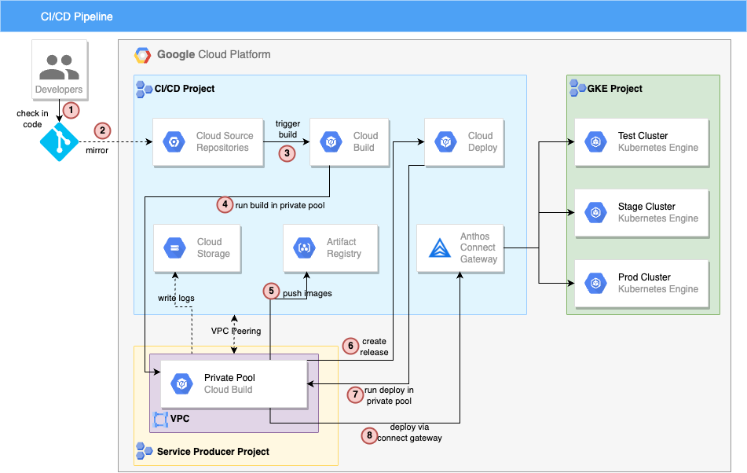

# Demo: Google Cloud CI/CD for GKE
This repo is based off of this [demo](https://github.com/vszal/pop-kustomize), with modifications made to incorporate Cloud Build and Cloud Deploy private pools, usage of Anthos Connect Gateway for connecting to GKE clusters, and other security-focused changes.

This repo demostrates CI/CD for GKE with Google Cloud tools Google Cloud Deploy, Cloud Build, and Artifact Registry. The example app is based on a simple Python Flask example app named "Population Stats" and uses Kustomize overlays to enable configuration differences across three different environments: test, staging, and prod..

[](https://user-images.githubusercontent.com/76225123/145627874-86971a34-768b-4fc0-9e96-d7a769961321.png)



## Fork this repo
This demo relies on you making git check-ins to simulate a developer workflow. So you'll need your own copy of these files in your own Github.com repo.

[Fork this repo on Github](https://github.com/Enzyme3/pop-kustomize/fork)

If you've already done that, you can start the setup tutorial below.

## Setup
The demo assumes that we are working in a semi-locked down environment that follows certain security-best practices, such as not using default service accounts(SAs), limiting access granted to SAs/admins, and enforcing key organization policy constraints. 2X sets of terraform scripts are provided to create such an environment in GCP.

### Pre-requisiste (env-foundations)
Skip this section if the following pre-reqs have already been created. If not, run the terraform script under `./terraform/env-foundations`
* 2X projects
    * one for GKE
    * one for CI/CD pipeline
* Org policies applied on both projects (set on parent folder):
    * constraints/compute.vmExternalIpAccess
    * constraints/iam.allowedPolicyMemberDomains
    * constraints/compute.skipDefaultNetworkCreation
* services enabled in both projects
    * compute.googleapis.com
* Custom VPC created in both projects
* VPC-SC NOT enabled

### P
### Environment

### Pre-requisites
* Projects with the above environment setup
* Services Enabled
    * compute.googleapis.com
    * cloudresourcemanager.googleapis.com
    * container.googleapis.com
    * artifactregistry.googleapis.com
    * containerscanning.googleapis.com
    * cloudbuild.googleapis.com
    * clouddeploy.googleapis.com
    * servicenetworking.googleapis.com
    * sourcerepo.googleapis.com
    * connectgateway.googleapis.com
    * anthos.googleapis.com
    * gkeconnect.googleapis.com
    * gkehub.googleapis.com
    * serviceusage.googleapis.com
* IAM
    * Admin creating pipeline should have following roles:
        * roles/artifactregistry.admin
        * roles/container.admin
        * roles/compute.networkAdmin
        * roles/compute.securityAdmin
        * roles/cloudbuild.workerPoolOwner
        * roles/cloudbuild.workerPoolUser
        * roles/clouddeploy.admin
        * roles/storage.admin
        * roles/serviceusage.serviceUsageConsumer
        * roles/cloudbuild.builds.editor
        * roles/source.admin
        * roles/logging.viewer
        * roles/gkehub.admin
    * 3X Service Account:
        * 1) SA for GKE
            * roles: 
                * roles/artifactregistry.reader
            * members who have roles/iam.serviceAccountUser on SA
                * admin user account
        * 2) SA for Cloud Build
            * roles: 
                * roles/storage.admin
                * roles/logging.logWriter
                * roles/artifactregistry.writer
                * roles/source.reader
                * roles/clouddeploy.jobRunner
                * roles/clouddeploy.releaser
            * members who have roles/iam.serviceAccountUser on SA
                * admin user account
            * members who have roles/iam.serviceAccountTokenCreator on SA
                * admin user account
        * 3) SA for Cloud Deploy
            * roles:
                * roles/storage.admin
                * roles/logging.logWriter
                * roles/container.developer
                * roles/gkehub.admin
                * roles/gkehub.gatewayEditor
            * members who have roles/iam.serviceAccountUser on SA
                * cloud build SA
                * admin user account

### Create Pipeline
```
# update and run in shell to set env vars
PROJECT_GKE=<project-id>
PROJECT_CICD=<project-id>
REGION=us-central1
VPC=my-new-vpc
SUBNET=us-central1
SA_GKE=my-gke-sa
SA_CLOUDBUILD=my-cloudbuild-sa
SA_CLOUDDEPLOY=my-clouddeploy-sa
GKE_TEST=test-cluster
GKE_STAGE=stage-cluster
GKE_PROD=prod-cluster
GCS_LOGS=<random-name-for-bucket>

PROJECT_GKE=kwpark-deloitte-gke-e968977c
PROJECT_CICD=kwpark-deloitte-cicd-e968977c
REGION=us-central1
VPC=my-new-vpc
SUBNET=us-central1
SA_GKE=my-gke-sa
SA_CLOUDBUILD=my-cloudbuild-sa
SA_CLOUDDEPLOY=my-clouddeploy-sa
GKE_TEST=my-test-cluster
GKE_STAGE=stage-cluster
GKE_PROD=prod-cluster
GCS_LOGS=kwpark-logs-again-cicd-123

# create Artifact Registry repo
gcloud artifacts repositories create pop-stats \
  --project $PROJECT_CICD \
  --location $REGION \
  --repository-format docker

# allocate named IP range for cloudbuild to use
gcloud compute addresses create cloudbuildrange \
  --project $PROJECT_CICD \
  --global \
  --purpose VPC_PEERING \
  --prefix-length 24 \
  --description "range for cloud build private pool" \
  --network projects/${PROJECT_CICD}/global/networks/${VPC}

# create private connection
gcloud services vpc-peerings connect \
  --service servicenetworking.googleapis.com \
  --ranges cloudbuildrange \
  --network $VPC \
  --project $PROJECT_CICD

# grab IP range that was created
gcloud compute addresses list \
  --project $PROJECT_CICD

# set IP_RANGE env var
IP_RANGE=10.50.232.0/24

# create ingress FW rule allowing requests from the IP range into VPC
gcloud compute firewall-rules create cloudbuildrange-ingress \
  --network $VPC \
  --direction ingress \
  --action allow \
  --source-ranges $IP_RANGE \
  --project $PROJECT_CICD \
  --rules all

# create cloud build private pool
gcloud builds worker-pools create my-private-pool \
  --project $PROJECT_CICD \
  --region $REGION \
  --peered-network projects/${PROJECT_CICD}/global/networks/${VPC} \
  --no-public-egress

# create GCS bucket to store build/deploy logs
gcloud storage buckets create gs://$GCS_LOGS \
  --project $PROJECT_CICD \
  --location $REGION

# create clouddeploy.yaml and fill in env-specific vars
sed "s/<PROJECT_CICD>/$PROJECT_CICD/g" clouddeploy.yaml.template > clouddeploy.yaml
sed -i "s/<PROJECT_GKE>/$PROJECT_GKE/g" clouddeploy.yaml
sed -i "s/<REGION>/$REGION/g" clouddeploy.yaml
sed -i "s/<GKE_TEST>/$GKE_TEST/g" clouddeploy.yaml
sed -i "s/<GKE_STAGE>/$GKE_STAGE/g" clouddeploy.yaml
sed -i "s/<GKE_PROD>/$GKE_PROD/g" clouddeploy.yaml
sed -i "s/<SA_CLOUDDEPLOY>/$SA_CLOUDDEPLOY/g" clouddeploy.yaml

# create cloud deploy pipeline
gcloud deploy apply \
  --file clouddeploy.yaml \
  --region $REGION \
  --project $PROJECT_CICD

# connect to a git repo and mirror it into Cloud Source Repositories
# from Cloud Build > Triggers, click `Manage Repositories` and add repo as Github (legacy)

# grab name of repo that was created
gcloud source repos list \
  --project $PROJECT_CICD

# set IP_RANGE env var
CSR=github_enzyme3_pop-kustomize

# create cloudbuild.yaml and fill in env-specific vars
sed "s/<PROJECT>/$PROJECT_CICD/g" cloudbuild.yaml.template > cloudbuild.yaml
sed -i "s/<REGION>/$REGION/g" cloudbuild.yaml
sed -i "s/<GCS_LOGS>/$GCS_LOGS/g" cloudbuild.yaml

# create trigger
gcloud beta builds triggers create cloud-source-repositories \
  --name my-trigger \
  --region $REGION \
  --build-config cloudbuild.yaml \
  --service-account projects/$PROJECT_CICD/serviceAccounts/$SA_CLOUDBUILD@$PROJECT_CICD.iam.gserviceaccount.com \
  --branch-pattern "^main$" \
  --project $PROJECT_CICD \
  --repo $CSR

# create SA for fleet host
gcloud beta services identity create \
  --service gkehub.googleapis.com \
  --project $PROJECT_CICD

# get project number of CICD project
PROJECT_CICD_NUMBER=$(gcloud projects describe "${PROJECT_CICD}" --format "value(projectNumber)")

# grant SA roles/gkehub.serviceAgent in CICD project
gcloud projects add-iam-policy-binding $PROJECT_CICD \
  --member "serviceAccount:service-${PROJECT_CICD_NUMBER}@gcp-sa-gkehub.iam.gserviceaccount.com" \
  --role roles/gkehub.serviceAgent

# grant SA roles/gkehub.serviceAgent in GKE project
gcloud projects add-iam-policy-binding $PROJECT_GKE \
  --member "serviceAccount:service-${PROJECT_CICD_NUMBER}@gcp-sa-gkehub.iam.gserviceaccount.com" \
  --role roles/gkehub.serviceAgent

# register cluster to fleet
 gcloud container fleet memberships register $GKE_TEST \
 --gke-uri=https://container.googleapis.com/v1/projects/${PROJECT_GKE}/locations/$REGION/clusters/$GKE_TEST \
 --enable-workload-identity \
 --project $PROJECT_CICD

gcloud container clusters get-credentials $GKE_TEST \
  --region $REGION \
  --project $PROJECT_GKE

gcloud beta container fleet memberships generate-gateway-rbac \
  --membership $GKE_TEST \
  --role clusterrole/cluster-admin \
  --users $SA_CLOUDDEPLOY@$PROJECT.iam.gserviceaccount.com \
  --project=$PROJECT_CICD \
  --kubeconfig ~/.kube/config \
  --context gke_${PROJECT_GKE}_${REGION}_${GKE_TEST} \
  --apply
